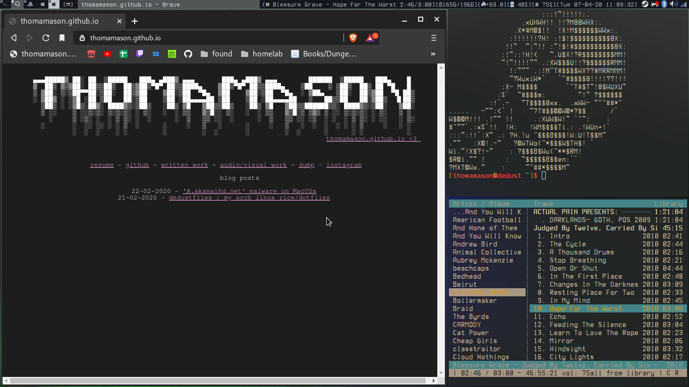

### thomamason's dotfiles ### v4 -- 07/04/2020

Welcome to my dotfiles repo. My main linux machine is an 1vyrained Thinkpad x230 w/ 7-row 'classic' keyboard, IPS screen (I'm going to upgrade to nitrocaster's FHD mod during the summer), and a second msata ssd for a win10 install.

The 'V4' of this file is for the 4th Arch install I've performed on this machine, each using these dotfiles in conjunction with a fork of Luke Smith's [LARBS](https://www.github.com/lukesmithxyz/LARBS) to bootstrap my system.

As such, many of these files are [luke smith's](https://www.lukesmith.xyz) 'larbs' & 'voidrice' repo's ripped apart and hacked together again to better suit my needs.

dmw is forked from luke's repo. dmenu and dunst are default configs.

**TO DO:**
	* Make script to toggle compositor transparency on/off.
	* Update scripts readme in .local/bin to explain new additions.
	* Tidy up my 'LARBS' fork.
	* Consider whether a seperate dotfiles directory with symlinks might be more efficient.
